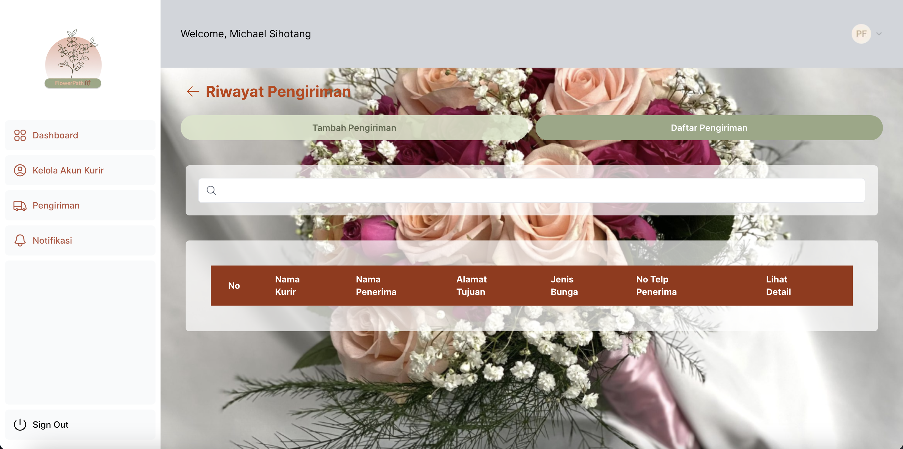

# FlowerPath - Aplikasi Pelacakan Pengiriman Bunga

## Bahasa Pemrograman
Dengan Next.js dan Supabase
1. Next.js
Next.js merupakan framework pengembangan web yang serbaguna. Dengan Next.js, frontend dan backend dari aplikasi web dapat dikembangkan dalam satu project saja.

2. Supabase
Adapun pemilihan database yaitu dengan Supabase sebagai platform pengembangan penuh fitur yang menyediakan database PostgreSQL yang dapat digunakan untuk pengembangan aplikasi web. 

## Tools Testing
Dengan Jest

1. Jest
Jest merupakan kerangka pengujian JavaScript yang digunakan untuk menguji aplikasi JavaScript dan React.

## Struktur Folder
```
.
├── doc
├── app
│   ├─── dashboard
│   │      ├─── kelolaakunkurir
│   │      │       ├─── id
│   │      │       ├─── action
│   │      │       ├─── tambahkurir
│   │      │       └─── page.tsx
│   │      ├─── notifikasi
│   │      ├─── pengiriman
│   │      │       ├─── id
│   │      │       ├─── action
│   │      │       ├─── riwayat
│   │      │       ├─── tambahpengiriman
│   │      │       └───page.tsx
│   │      ├─── layout.tsx
│   │      └─── page.tsx
│   ├─── kurir
│   │      ├─── action
│   │      ├─── paket
│   │      ├─── layout.tsx
│   │      └─── page.tsx
│   ├─── login
│   │      ├─── action
│   │      └─── page.tsx
│   ├─── favicon.ico
│   ├─── fonts.ts
│   ├─── global.css
│   ├─── layout.tsx
│   └─── page.tsx
├── components
├── lib
│   ├─── BannerRNG.txt
│   ├─── BannerRNG.txt
│   └─── BannerRNG.txt
├── public
├── jest.config.js
├── jest.setup.js
├── middleware.ts
├── next-env.d.ts
├── next.config.js
├── package-lock.json
├── package.json
├── postscc.config.js
├── readme.md
├── tailwind.config.ts
└── tsconfig.json
```

## Deskripsi Singkat Aplikasi
FlowerPath adalah aplikasi web pelacakan pengiriman bunga dari toko bunga hingga sampai ke tangan pelanggan. Aplikasi ini dibuat untuk memudahkan manajer operasional dan kurir dalam mengelola dan memantau proses pengiriman. Manajer operasional dapat mengelola akun kurir, menambahkan pengiriman, melihat daftar pengiriman, serta melihat riwayat pengiriman. Kurir dapat melihat tugas pengiriman, melihat detail pengiriman, melaporkan masalah, dan melakukan update status pengiriman.

## Cara Menjalankan Aplikasi
Untuk menjalankan aplikasi, Anda dapat menggunakan perintah berikut:
```bash
npm run dev
# or
yarn dev
# or
pnpm dev
# or
bun dev
```

## Daftar Use Case yang Diimplementasi

| ID  | Use Case                   | Deskripsi                                                             | Bobot Use Case | PIC     |
|-----|----------------------------|-----------------------------------------------------------------------|----------------|---------|
| UC01| Login                      | Sistem mengautentikasi aktor dari nama pengguna dan password          | Medium         | Michael Sihotang (18221054) |
| UC02| Mengelola Akun Kurir       | Sistem memberikan pilihan untuk menambah, menghapus, atau memperbaharui akun kurir | Hard           | Michael Sihotang (18221054) |
| UC03| Menambah Pengiriman         | Sistem mendapatkan penambahan pengiriman baru yang dilakukan oleh aktor | Hard           | Reinhart Lim  (18221154) |
| UC04| Melihat Daftar Pengiriman   | Sistem menampilkan daftar pengiriman yang sedang berlangsung           | Easy           | Erensi Ratu Chelsia (18221166) |
| UC05| Melihat Detail Pengiriman   | Sistem menampilkan detail dari sebuah pengiriman                      | Medium         | Erensi  Ratu Chelsia (18221166) |
| UC06| Melihat Riwayat Pengiriman  | Sistem menampilkan daftar pengiriman yang telah selesai               | Easy           | Erensi  Ratu Chelsia (18221166) |
| UC07| Melihat Paket yang Akan Diantar | Sistem menampilkan paket yang akan diantarkan kurir               | Medium         | Gracia Theophillia (18221078) |
| UC08| Melihat Detail Paket        | Sistem menampilkan detail dari sebuah paket                           | Medium         | Gracia Theophillia (18221078) |
| UC09| Melaporkan Masalah          | Sistem menerima laporan masalah dari sebuah pengiriman               | -              | -       |
| UC10| Menambahkan Foto dan Catatan | Sistem mendapatkan unggahan keterangan foto dan catatan bagi pengantaran yang statusnya sudah delivered | Medium | Reinhart Lim  (18221154) |
| UC11| Ubah Status Pengiriman      | Sistem menerima pengubahan status dari sebuah pengiriman              | Easy           | Gracia Theophillia (18221078) |
| UC12| Menerima Notifikasi Masalah | Sistem mendapatkan pemberitahuan jika muncul masalah pada sebuah pengiriman | -           | -       |

## Capture Screen Tampilan Layar
**1. Login**

Autentikasi aktor dari nama pengguna dan password.

**2. Dashboard Manajer Operasional**

Berisi tampilan awal yang terdapat tombol sign out di bawahnya dan rangkuman dari total kurir, total pengiriman, total riwayat, dan total laporan.

**3. Kelola Akun Kurir**

Berisi tampilan daftar akun kurir yang terdiri dari tombol tambah akun kurir, hapus, dan edit.

**4. Tambah Akun Kurir**

Berisi tampilan untuk menambah akun kurir yang terdiri dari masukan nama, email, password, dan konfirmasi password/

**5. Daftar Pengiriman**

Berisi tampilan daftar pengiriman yang didalamnya terdiri dari tombol riwayat, tambah pengiriman, tombol lihat detail di dalam tabel, dan ada pula searchbar untuk mencari pengiriman berdasarkan nama kurir.

**6. Tambah Pengiriman**

Berisi tampilan untuk menambahkan pengiriman.

**7. Riwayat Pengiriman**

Berisi tampilan daftar riwayat pengiriman yang didalamnya terdiri dari tombol lihat detail di dalam tabel, dan ada pula searchbar untuk mencari pengiriman berdasarkan nama kurir.

**8. Detail Pengiriman**

Berisi tampilan detail pengiriman yang didalamnya terdapat tambahan status pengiriman dan keterangan paket.

**9. Dashboard Kurir**

Berisi tampilan awal yang terdapat tombol sign out di bawahnya dan berisi rangkuman dari total paket berlangsung, total paket selesai, dan total paket bermasalah.

**10. Daftar Paket**

Berisi tampilan daftar seluruh paket yang terdiri dari berlangsung, bermasalah, dan selesai. Selain itu, ada pula search bar dan tombol lihat detail di tabelnya untuk melihat detail dari paket.

**11. Detail Paket**

Berisi tampilan detail paket yang didalamnya terdapat keterangan paket dan laporan masalah.

## Daftar Tabel Basis Data yang Diimplementasi


**1. Tabel `pengiriman`:**
   - `id` (Primary Key)
   - `created_at`
   - `idpaket`
   - `idkurir`
   - `statuspengiriman`
   - `fotopengiriman`
   - `catatanpengiriman`

**2. Tabel `paket`:**
   - `id` (Foreign Key)
   - `created_at`
   - `alamat`
   - `penerima`
   - `jenisbunga`
   - `notelp`
   - `catatan`

**3. Tabel `users`:**
   - `id` (Foreign Key)
   - `created_at`
   - `nama`
   - `role`
   - `email`